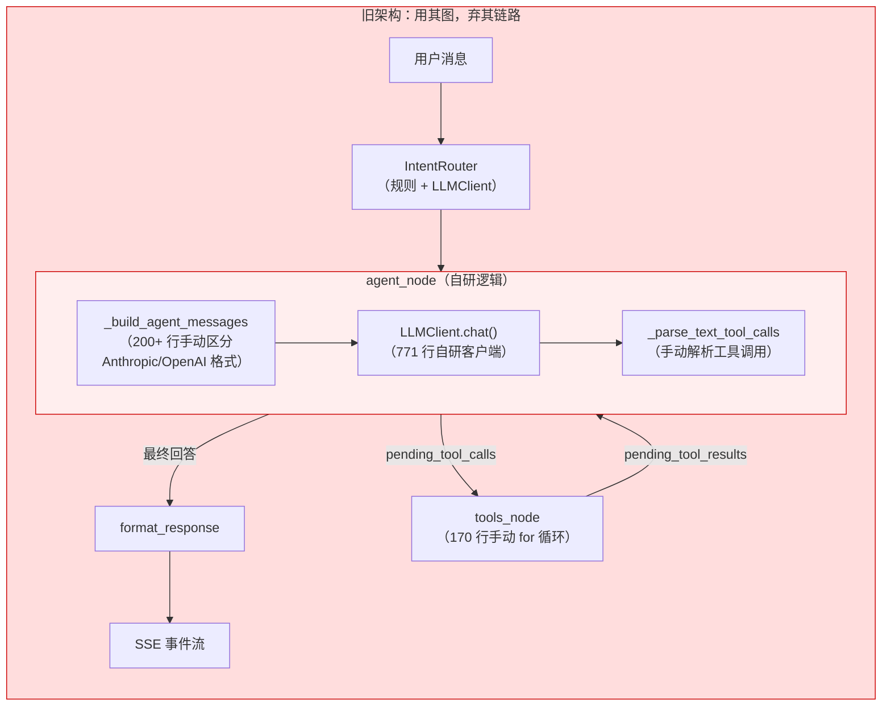
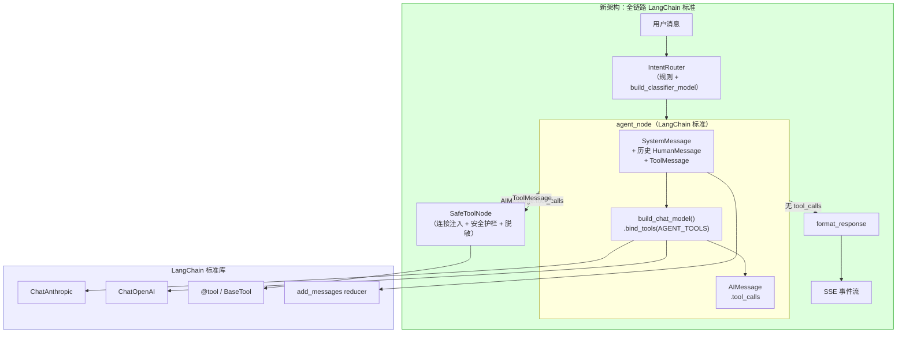
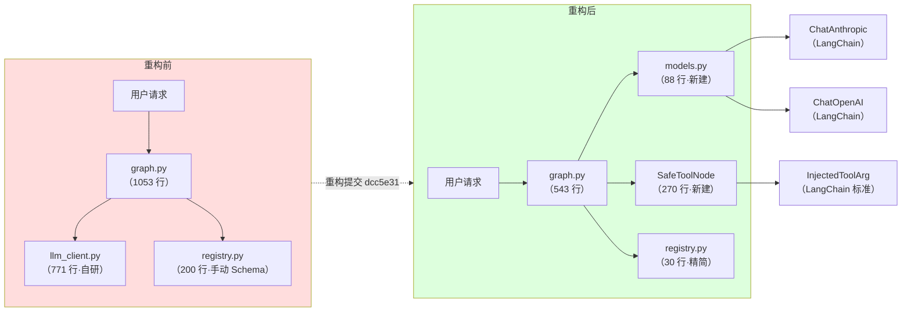
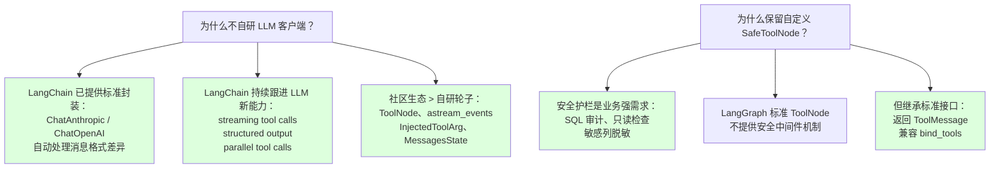

# 后端 Agent 架构 LangChain/LangGraph 标准化重构复盘

> **作者**: DB-Pilot 团队 · **日期**: 2026-07-03 · **提交**: `dcc5e31`

---

## 目录

1. [概述](#1-概述)
2. [架构对比：旧架构 vs 新架构](#2-架构对比旧架构-vs-新架构)
3. [为什么需要重构](#3-为什么需要重构)
4. [关键设计决策](#4-关键设计决策)
5. [文件变更清单](#5-文件变更清单)
6. [数据流变化](#6-数据流变化)
7. [关键指标对比](#7-关键指标对比)
8. [经验与教训](#8-经验与教训)

---

## 1. 概述

本次重构的核心目标是将 **"用 LangGraph 的骨架，但所有 LLM 交互全自研"** 的混合架构，全面转为 **LangChain/LangGraph 标准生态**。

### 一句话总结

> **移除 771 行自研 LLM 客户端（`llm_client.py`），替换为 3 个 LangChain 标准文件（`models.py` + `tool_node.py` + 简化版 `registry.py`），净减 ~274 行代码，消除 50% 的自研冗余。**

---

## 2. 架构对比：旧架构 vs 新架构

### 2.1 旧架构（重构前）



### 2.2 新架构（重构后）



### 2.3 架构演进全景



---

## 3. 为什么需要重构

### 3.1 痛点分析

| # | 痛点 | 具体表现 | 影响 |
|---|------|---------|------|
| 1 | **每个 provider 都要手动适配** | `_build_agent_messages` 中 200+ 行的 `if provider == "anthropic"` vs `elif provider == "openai"` 分支 | 新增 provider 需要大量编码；streaming/structured output 等新能力无法自动获得 |
| 2 | **工具 Schema 手动转换** | `_tool_to_anthropic_schema()`、`_clean_schema_property()`、`_extract_args_schema()` 等轮子 | 每次修改工具签名都要同步修改 Schema 转换逻辑，容易遗漏 |
| 3 | **工具执行与生态隔离** | `tools_node` 用 `TOOL_REGISTRY.get()` + `tool_fn.ainvoke()` 手动派发 | 无法复用 LangGraph 社区的 ToolNode 生态（并行执行、错误处理、中断恢复） |
| 4 | **代码膨胀** | `llm_client.py` 771 行 + `graph.py` 1053 行 = 1824 行自研代码 | 维护负担重，新人上手难 |
| 5 | **消息格式硬编码** | 手动构造 Anthropic `tool_use/tool_result` 和 OpenAI `tool_calls/role:tool` 格式 | 消息格式与 provider 耦合，无法切换 |

### 3.2 决策树



---

## 4. 关键设计决策

### 4.1 连接参数注入：`InjectedToolArg`

**问题**：工具函数需要连接参数（`host`、`port`、`password` 等）来连接数据库，但这些参数不应暴露给 LLM。

**方案**：使用 LangChain 标准 `Annotated[str, InjectedToolArg]` 标注：

```python
# 旧方案：手动 Schema 过滤列表
_INJECTED_CONN_PARAMS = {"connection_id", "db_type", "host", "port", ...}

# 新方案：类型标注驱动
@tool
async def list_tables(
    connection_id: Annotated[str, InjectedToolArg],  # ← LLM 不可见
    db_type: Annotated[str, InjectedToolArg],         # ← LLM 不可见
    # ...
) -> dict[str, Any]:
```

`bind_tools()` 自动从 Schema 中排除 `InjectedToolArg` 标注的参数，无需手维护过滤列表。

### 4.2 SafeToolNode vs 标准 ToolNode

**问题**：标准 `ToolNode` 只做工具执行，不提供安全检查和结果脱敏。

**方案**：不继承 `ToolNode`（因需完全自定义执行逻辑），而是实现为标准 LangGraph 节点函数，但**遵守消息契约**——输入 `AIMessage.tool_calls`，输出 `ToolMessage` 列表：

```
SafeToolNode 执行流水线：
  AIMessage.tool_calls
    → 连接配置注入（conn_config → tool_args）
    → 安全护栏（SQL 审计 / 只读检查 / 连接限额）
    → 工具执行（TOOL_REGISTRY.get() → tool_fn.ainvoke()）
    → 结果脱敏（敏感列掩码）
    → ToolMessage 列表
```

这样既满足业务安全需求，又与 LangGraph 标准图兼容。

### 4.3 引擎层迁移（nl2sql / diagnosis）

**问题**：`nl2sql.py` 和 `diagnosis.py` 直接使用旧 `LLMClient`，存在重复的 LLM 调用逻辑。

**方案**：统一通过 `build_chat_model()` 获取模型实例，使用标准 `SystemMessage` + `HumanMessage`：

```python
# 旧：
client = LLMClient()
resp = await client.chat(messages=[...], system=..., max_tokens=..., timeout=...)
text = resp.text

# 新：
model = build_chat_model(max_tokens=..., timeout=...)
response = await model.ainvoke([SystemMessage(content=sys), HumanMessage(content=user)])
text = response.content if isinstance(response.content, str) else str(response.content)
```

### 4.4 API 兼容性降级

**发现**：阿里百炼 DashScope 的 `compatible-mode` 端口中，`qwen-max` 返回 DashScope 原生格式（`finish_reason`/`text`）而非 OpenAI 标准格式（`choices`/`message`），导致 LangChain `ChatOpenAI` 无法解析。

**处理**：
1. 在 `agent_node` 添加 `choices: null` 异常捕获和友好降级
2. 文档记录：使用 `qwen-plus` 可正确返回 OpenAI 标准格式

---

## 5. 文件变更清单

### 5.1 新增文件

| 文件 | 行数 | 职责 |
|------|------|------|
| `backend/app/agent/models.py` | 88 | `build_chat_model()` / `build_classifier_model()` 工厂函数 |
| `backend/app/agent/tool_node.py` | 270 | `safe_tools_node` — 安全工具执行节点 |
| `docs/refactoring-plan.md` | — | 重构计划文档 |
| `frontend/FRONTEND_CHANGES_v2.md` | — | 前端影响清单 |

### 5.2 删除文件

| 文件 | 行数 | 原因 |
|------|------|------|
| `backend/app/engine/llm_client.py` | **-771** | 被 LangChain Chat 模型取代 |

### 5.3 修改文件

| 文件 | 行数变化 | 变更内容 |
|------|---------|---------|
| `backend/app/agent/graph.py` | **-510** | agent_node 重写，移除 _build_agent_messages 等死代码 |
| `backend/app/agent/tools/registry.py` | **-170** | 移除手动 Schema 过滤，仅保留工具列表 |
| `backend/app/agent/tools/query.py` | -18 | 添加 `InjectedToolArg` 标注 |
| `backend/app/agent/tools/diagnosis.py` | -8 | 同上 |
| `backend/app/agent/tools/health.py` | -4 | 同上 |
| `backend/app/agent/tools/troubleshoot.py` | -10 | 同上 |
| `backend/app/agent/state.py` | +35 | 引入 `add_messages` reducer |
| `backend/app/agent/router.py` | +10 | IntentRouter 改用 BaseChatModel |
| `backend/app/api/chat.py` | +12 | 适配新 AgentState |
| `backend/app/api/troubleshoot.py` | +12 | 同上 |
| `backend/app/engine/nl2sql.py` | +5 | 迁移到 `build_chat_model()` |
| `backend/app/engine/diagnosis.py` | +3 | 同上 |
| `backend/requirements.txt` | +3 | 添加 langchain 依赖 |

---

## 6. 数据流变化

### 6.1 消息格式流

```
旧架构：
  用户消息（str）→ 手动构建 Anthropic/OpenAI 格式
    → LLMClient.chat() → LLMResponse（自定义）
    → _parse_text_tool_calls() → 手动解析 ToolCall（自定义）
    → tools_node 执行 → pending_tool_results（自定义）

新架构：
  HumanMessage(content=...) → SystemMessage + HumanMessage + ...
    → model.ainvoke() → AIMessage（标准）
    → AIMessage.tool_calls（标准 ToolCall 列表）
    → SafeToolNode → ToolMessage（标准）
    → add_messages reducer 自动追加到状态
```

### 6.2 SSE 事件流

```
旧架构：
  state["messages"] 增量读取 → 手动解析 type 字段

新架构（保持不变）：
  state["sse_events"] 增量读取 → 7 种 type：
    thinking / tool_call / tool_result / sql / result / error / done
```

SSE 事件格式完全向后兼容，**前端无需修改**。

---

## 7. 关键指标对比

| 指标 | 重构前 | 重构后 | 变化 |
|------|--------|--------|------|
| `llm_client.py` | 771 行 | **0 行**（已删除） | -100% |
| `graph.py` | 1053 行 | **543 行** | **-48%** |
| `registry.py` | 200+ 行 | **~30 行** | **-85%** |
| 总自研代码 | ~1824 行 | ~550 行（SafeToolNode） | **-70%** |
| 消息格式兼容 | 手写 Anthropic/OpenAI 分支 | LangChain 自动处理 | 零维护 |
| 工具 Schema | 手动转换 + 过滤列表 | `bind_tools()` + `InjectedToolArg` | 零维护 |
| Provider 切换 | 需改代码 | `LLM_PROVIDER=anthropic|openai` | 配置驱动 |
| 测试通过 | — | **22/22 通过** | 100% |

---

## 8. 经验与教训

### 8.1 做得好的

1. **渐进式重构**：从 Chat 模型工厂 → AgentState → 工具签名 → agent_node → SafeToolNode → 图结构 → SSE → 清理，逐步推进，每步可独立验证
2. **保留安全层**：没有为了标准化而放弃安全需求，SafeToolNode 在标准框架内实现业务安全
3. **测试先行**：重构全程保持测试通过，22 项测试持续绿灯

### 8.2 踩过的坑

1. **`InjectedToolArg` 的 Schema 可见性**：`tool.get_input_schema()` 仍返回所有参数（含注入参数），但 `bind_tools()` 层正确排除。这是 LangChain 设计的内部验证 vs LLM Schema 分离，理解了这个设计就不算坑。
2. **阿里百炼 API 响应格式不一致**：`qwen-max` vs `qwen-plus` 在同一 `compatible-mode` 端点上返回不同格式。解决方法：`agent_node` 中添加 `choices: null` 降级处理。
3. **`add_messages` reducer 的列表扁平化**：返回 `{"messages": [msg]}` 时，reducer 会自动追加；但若误传嵌套列表会导致类型错误。

### 8.3 后续建议

1. **考虑迁移到 `astream_events()`**：当前 SSE 流仍使用 `stream_mode="values"` + `sse_events` 字段，未来可迁移到 LangGraph 标准事件监听
2. **SafeToolNode 可继承 ToolNode**：若未来需要中断/审批等人机交互功能，可以改为继承 `ToolNode` 并覆写 `_arun_one()` 方法
3. **单元测试覆盖**：当前缺少 SafeToolNode 和 models.py 的单元测试，建议补充

---

> **附录**：完整重构计划见 [docs/refactoring-plan.md](refactoring-plan.md)，提交记录见 `git log dcc5e31`。
